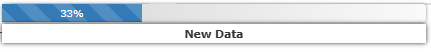

# Working only in JS

* `sd.startProgess()`

the above command will initiate the process

* `sd.updateProgress("New Data",33)`

This command will update the message as `New Data` and with `33%` completion

<figure><figcaption></figcaption></figure>

```javascript
jI("progressBar").hide();
jSF("#progressBar div").css({ "width": "0%" }).innerHTML = "0 %";
```

These command will reset the progress bar and hides them
